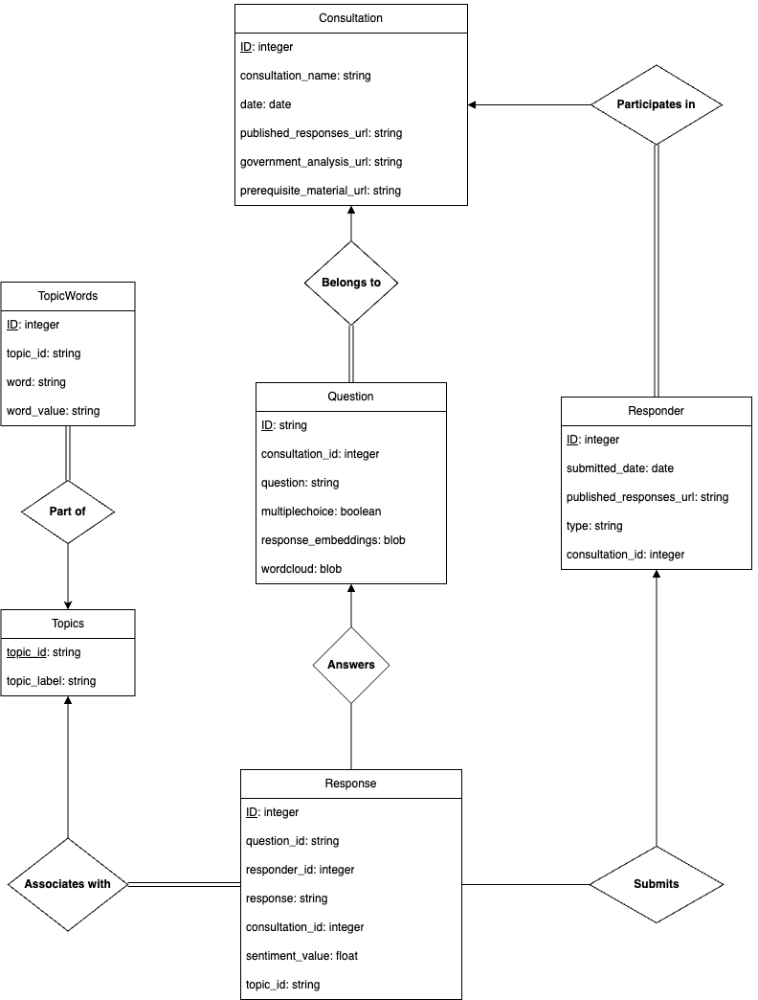

# DecodingDemocracy

## Project Outline

This project involves analyising public consultation responses in participatory democracy. Deep learning techniques are used to unveil insights within citizens’ expressions using sentiment analysis.

### Key Objectives

1. Develop a Database Framework - Implement a robust ER model to capture information about three consultations and public responses, so that the data can be easily queried and analyzed.
2. Apply AI/NLP (Deep Learning Anylisis) - Apply methodologies like sentiment analysis and topic modeling to extract valuable insights from citizens’ input, as well as exploring alternative deep learning models for potential improvement.
3. Craft a User-Friendly Web Tool (dashboard) - Design an intuitive web dashboard serving as the front-end for AI analysis, automatically delivering insights from selected consultations.

## Instructions to reproduce the project

The following section will outline the steps required to reproduce the project, including how to make the database, how to import the data into the database, how to connect to the google colab notebook and how to run the web application.

1. Create a folder called `DecodingDemocracy/` in google drive to store everything related to this project.
2. Copy the [excel](./excel) directory with the 3 consultation files into the folder `DecodingDemocracy/`.
3. Copy the [requirements.txt](./requirements.txt) file into the folder `DecodingDemocracy/`.
4. Create a folder called `csv/` under `DecodingDemocracy/`.
5. Copy the csv file [sample_sentiment_values.csv](./sample_sentiment_values.csv) into the `DecodingDemocracy/` folder.
6. Copy the notebook [notebook.ipynb](./notebook.ipynb) into a Google Colab notebook under the `DecodingDemocracy/` folder.
7. Run the first 3 cells in the notebook to create and populate the database called `db.sqlite` with the consultations data. Check these were created successfully.

## Instructions to run the web dashboard

1. Clone this repository to your local machine (`git clone https://github.com/BrunoCecco/DecodingDemocracy.git`).
2. `cd website`
3. Add a .env file under `/website` with the line 'DB_PATH=db.sqlite'
4. Download the database file as db.sqlite and add the file to `/api`
5. `npm install`
6. `npm run dev`
8. Navigate to https://localhost:3000

### Database Design (Old)

Here is an ER Model of the database used to store the data on consultations and responses. The database was created using SQLite since Python is the main language used.

### Colab notebooks

https://colab.research.google.com/drive/1WrPmMlMB9fAc4MB5oz5OaVdsjBPGShkN?usp=sharing
